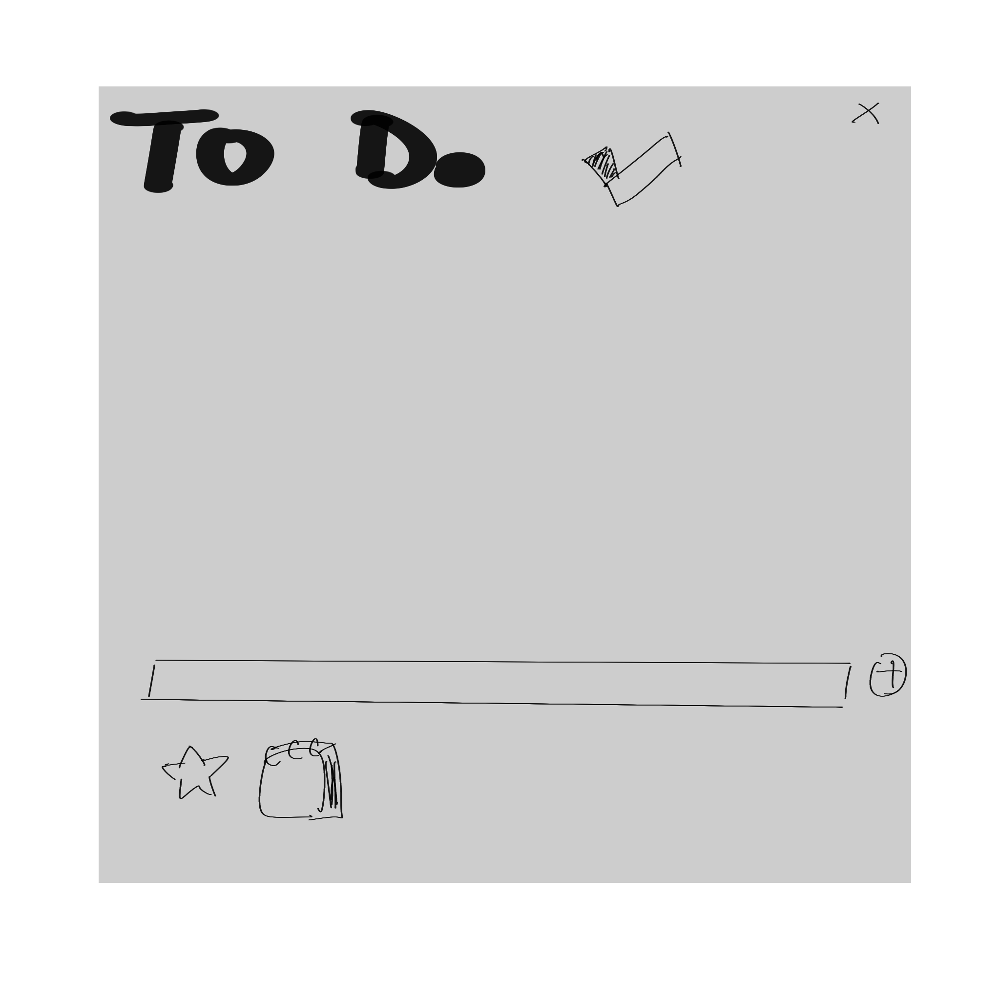

# Microsoft To Do 桌面挂件（Rainmeter 版）

一个**常驻桌面**的 Windows 挂件，直接显示并管理你真实的 **Microsoft To Do** 任务。用 **Rainmeter 皮肤 + PowerShell** 实现，直连 Microsoft Graph。**无需注册 Azure 应用、无需管理员权限。**

相比普通窗口挂件，它是**真正的桌面级挂件**：贴在桌面上、被其它窗口遮挡、不占 Alt-Tab、点"显示桌面"也**不会消失**。

> 🌐 **English version below · 英文版见文末**



---

## ✨ 功能

- **实时同步 Microsoft To Do**（Microsoft Graph）——每 ~3 分钟自动刷新，也可点 **↻** 手动刷。
- **添加任务**：输入框左侧 **☆ 重要**、**📅 日期**（弹出可点选的月历），右侧 **＋**；回车或点 ＋ 添加。
- **完成任务**：点任务前的 **○**（悬停变实心 ●）。完成是**乐观刷新**——本地**立即消失**，再后台跟服务器确认。//所以请不要快速连点！
- **智能分层排序**：即将截止/逾期（带星标优先）→ 重要 → 有日期 → 普通。
- **日期显示**：`今天` / `明天` / `MM-DD`；逾期显示 `MM-DD(已逾期)`（红色）；非今年显示年份。
- **底部计数**：`注意`（即将截止）· `重要` · `全部`。
- **可点选月历**：点 📅 弹出独立日历皮肤，`«‹ ›»` 翻年/翻月，今天高亮，点某天设为截止日；右键 📅 清除。
- **调节条（可收起）**：底部左下的 **`>`** 展开出四根滑条 —— **透明度 · 字体 · 宽度 · 高度**；再点 **`⌄`** 收起。
  - **滑条是"点击定位"式**：**点轨道哪个位置就设到哪，按下瞬间生效**（Rainmeter 无法像窗口那样按住拖动圆钮，所以用点击设定 + 滚轮微调）。
  - **宽度 / 高度固定整个框的尺寸**（不随任务数变化）；任务放不下时右侧出**圆角滚动条**，鼠标滚轮在任务区滚动。
- **位置/大小锁 🔒**：锁定后不能拖动、滑条禁用；再点解锁。
- **悬停说明开关 ?**：点一下关闭所有悬停提示，再点恢复（不影响按钮功能）。
- **切换账号**：**双击左上「To Do」标题** → 弹设备码登录 → 换账号。
- **字体**：Lucida Sans Unicode（西文）+ 幼圆（中文），按内容自动选。
- **开机自启**（`setup.ps1` 自动配置）。

## ✅ 运行要求

- Windows 10 / 11
- Windows PowerShell 5.1（系统自带）
- **Rainmeter**（没有的话 `setup.ps1` 会自动帮你装）
- 一个用 Microsoft To Do 的微软账号（个人 outlook/hotmail，或工作/学校账号）

## 🚀 快速开始

1. **下载**本文件夹（**Code → Download ZIP**，或 `git clone`），解压到任意固定位置（别放临时目录）。
2. 右键 **`setup.ps1`** →「**使用 PowerShell 运行**」，或在终端：
   ```powershell
   powershell -ExecutionPolicy Bypass -File .\setup.ps1
   ```
   它会：**①** 检测/自动安装 Rainmeter → **②** 设开机自启 → **③** 弹设备码登录（照着网址+验证码登录并授权「Microsoft Graph Command Line Tools」）→ **④** 生成并激活桌面挂件 → **⑤** 建桌面「To Do Widget」快捷方式。
3. 完成，挂件就在桌面上了，开机自动加载。

## 🕹 使用

| 操作 | 方法 |
|---|---|
| 加任务 | 输入框打字 →（可选）点 **☆**、点 **📅** 选日期 → **回车** 或 **＋** |
| 选日期 | 点 **📅** → 月历上 `«‹ ›»` 翻年/月 → 点某天；**右键 📅** 清除 |
| 完成任务 | 点任务前 **○**（悬停变 ●，点完立即消失） |
| 立即刷新 | **↻**（右上）——本身每 ~3 分钟自动刷新 |
| 调透明/字体/宽/高 | 点底部左下 **`>`** 展开 → **点滑条轨道设定**（点哪设哪），或在轨道上**滚滚轮**微调 |
| 锁定位置/大小 | 点 **🔒**（右上）；再点解锁 |
| 关/开悬停说明 | 点 **?**（右上） |
| **切换账号** | **双击「To Do」标题** |
| 关闭 / 重开 | **✕**（右上）关闭；桌面双击 **「To Do Widget」** 快捷方式重开 |

## 🔐 鉴权与隐私

- 使用微软**第一方公共客户端「Microsoft Graph Command Line Tools」**（`client_id 14d82eec-204b-4c2f-b7e8-296a70dab67e`）+ **OAuth 设备码登录**。这是**公共** client id，**你无需注册任何应用**。
- 权限：**`Tasks.ReadWrite offline_access`** —— 只读取你的清单/任务并添加/完成。
- **刷新令牌**存在 `token.dat`，用 **DPAPI 加密**（绑定当前 Windows 用户+本机），**永不离开本机**，且被 **.gitignore 排除**（不在仓库里）。
- **切换/退出**：双击标题换账号，或删掉 `token.dat` 后重跑 `setup.ps1`。

## 📁 文件

| 文件 | 作用 |
|---|---|
| `setup.ps1` | **首次运行**：装 Rainmeter + 开机自启 + 登录 + 激活挂件 |
| `todo-export.ps1` | 联网取任务 → 缓存 `tasks.json` → 触发渲染 |
| `todo-render.ps1` | 读缓存+设置 → 生成 Rainmeter 皮肤（不联网，秒出） |
| `todo-action.ps1` | 完成/添加/星标/日期/透明/字体/宽/高/锁/滚动/收起 等所有动作 |
| `todo-cal.ps1` | 生成可点选月历皮肤 |
| `todo-auth.ps1` | 设备码登录 |
| `run-*.vbs` / `open-widget.vbs` | 无窗口启动各脚本 / 重开挂件 |
| `logo.png` `icon.ico` | 图标 |
| *(运行时生成，已 .gitignore)* | `token.dat`、`settings.txt`、`pending.txt`、`tips.txt`、`panel.txt`、`scroll.txt`、`tasks.json` |

皮肤本身生成在 `文档\Rainmeter\Skins\ToDo`（和 `ToDoCal`）。所有脚本路径都相对自身目录，放哪都能用。

## 🛠 说明与排错

- **改 `.ps1` 时**：里面有中文/emoji，**必须存成 UTF-8 *带 BOM***，否则 PowerShell 5.1 会按本地代码页解码、解析失败、脚本静默不运行。
- **皮肤文件是 UTF-16 LE**：`todo-render.ps1` / `todo-cal.ps1` 写 `.ini` 用 UTF-16 —— Rainmeter 对 UTF-8 支持不稳，中文会乱码。
- **Rainmeter 安装路径检测**：脚本会自动检测 Rainmeter 安装位置（64 位：`C:\Program Files\Rainmeter\`，32 位：`C:\Program Files (x86)\Rainmeter\`）。如果你安装在自定义位置，需要手动修改以下文件中的 `$rmExe` 变量：`setup.ps1`、`todo-action.ps1`、`todo-render.ps1`、`todo-cal.ps1`。
- **任务不同步 / 卡"正在同步"（用了代理）**：某些本地代理会破坏 To Do 的长连接。把这些加到代理**绕过列表**：
  `*.microsoft.com;*.office.com;*.office365.com;*.live.com;*.outlook.com;*.microsoftonline.com`
- **挂件没出现**：确认 Rainmeter 在运行；重跑 `setup.ps1`；或在 Rainmeter 管理器里激活 `ToDo\ToDo.ini`。默认皮肤路径是 `文档\Rainmeter\Skins`。
- **授权过期 / 什么都不显示**：双击标题换账号，或删 `token.dat` 重跑 `setup.ps1`。

## 📜 许可证

MIT，见 `LICENSE`。

<br>

---
---

<br>

# Microsoft To Do — Desktop Widget (Rainmeter)  ·  English

An **always-on-the-desktop** Windows widget for your real **Microsoft To Do** tasks, built with a **Rainmeter skin + PowerShell** talking straight to Microsoft Graph. **No Azure app registration, no admin rights.**

Unlike a normal window, it's a **true desktop-level widget**: it sits on the wallpaper, is covered by app windows, stays out of Alt-Tab, and **doesn't vanish when you click "Show Desktop".**

## ✨ Features

- **Live Microsoft To Do sync** (Graph) — auto-refresh every ~3 min, plus a manual **↻**.
- **Add tasks**: **☆ importance** and **📅 date** (a clickable pop-up calendar) sit to the *left* of the input box, **＋** to the right. Enter or click ＋ to add.
- **Complete**: click the **○** (hover fills to ●). Completion is **optimistic** — the task disappears **instantly**, then syncs to the server.
- **Smart tiered sorting**, due-date formatting (`Today`/`Tomorrow`/`MM-DD`, overdue in red), and bottom counters (near-due · important · all).
- **Clickable month calendar**: `«‹ ›»` navigate year/month, today highlighted; right-click 📅 clears the date.
- **Adjuster sliders (collapsible)**: a **`>`** at the bottom-left expands **Opacity · Font · Width · Height**; **`⌄`** collapses.
  - **Sliders are click-to-set: click anywhere on the track to jump there, applied on mouse-down.** (Rainmeter can't drag a thumb like a window, so it's click-to-set + scroll-wheel fine-tuning.)
  - **Width / Height set a fixed box size** (independent of the task count); overflow shows a rounded scrollbar and the wheel scrolls the list.
- **Lock 🔒** (position + size + sliders), **tooltip toggle ?**, **account switch** (double-click the "To Do" title), and **auto-start at login**.
- **Fonts**: Lucida Sans Unicode (Latin) + YouYuan (CJK), chosen per item.

## ✅ Requirements

Windows 10/11 · Windows PowerShell 5.1 (built-in) · **Rainmeter** (`setup.ps1` installs it if missing) · a Microsoft account that uses To Do.

## 🚀 Quick start

1. **Download** this folder (Code → Download ZIP, or `git clone`) and unzip to a permanent location.
2. Right-click **`setup.ps1`** → **Run with PowerShell** (or `powershell -ExecutionPolicy Bypass -File .\setup.ps1`). It: **①** installs Rainmeter if needed → **②** enables auto-start → **③** device-code sign-in (open the URL, enter the code, approve *Microsoft Graph Command Line Tools*) → **④** builds & activates the desktop widget → **⑤** makes a desktop "To Do Widget" shortcut.
3. Done — the widget is on your desktop and starts with Windows.

## 🕹 Usage

| Action | How |
|---|---|
| Add a task | Type → optionally **☆** / **📅** pick a date → **Enter** or **＋** |
| Pick a date | Click **📅** → `«‹ ›»` to navigate → click a day; **right-click 📅** to clear |
| Complete | Click the **○** (hover ●; it vanishes instantly) |
| Refresh now | **↻** (top-right); also auto-refreshes every ~3 min |
| Opacity/Font/Width/Height | Click **`>`** (bottom-left) to expand → **click the slider track to set**, or **scroll** on it to fine-tune |
| Lock position/size | Click **🔒** (top-right) |
| Toggle tooltips | Click **?** (top-right) |
| **Switch account** | **Double-click the "To Do" title** |
| Close / Reopen | **✕** to close; double-click the desktop **"To Do Widget"** shortcut to reopen |

## 🔐 Auth & privacy

Microsoft's first-party public client **"Microsoft Graph Command Line Tools"** (`client_id 14d82eec-…`) with the **device-code flow** — a *public* client id, so **you register nothing**. Scope **`Tasks.ReadWrite offline_access`**. Your refresh token lives in `token.dat`, **DPAPI-encrypted** (bound to your Windows user + machine), **never leaves your PC**, and is **git-ignored**. Switch/sign out: double-click the title, or delete `token.dat` and re-run `setup.ps1`.

## 📁 Files

`setup.ps1` (one-time setup) · `todo-export.ps1` (fetch→cache→render) · `todo-render.ps1` (cache+settings→skin, offline) · `todo-action.ps1` (all interactions) · `todo-cal.ps1` (calendar skin) · `todo-auth.ps1` (device-code login) · `run-*.vbs` / `open-widget.vbs` (hidden launchers) · `logo.png` `icon.ico`. Runtime/personal files (`token.dat`, `settings.txt`, `tasks.json`, …) are generated locally and **git-ignored**.

## 🛠 Notes & troubleshooting

- **Editing `.ps1`**: they contain CJK/emoji, so save as **UTF-8 *with BOM*** (PowerShell 5.1 otherwise mis-decodes them and the script silently won't run).
- **Skin `.ini` files are UTF-16 LE** (Rainmeter's Unicode; UTF-8 garbles CJK).
- **Rainmeter path detection**: Scripts auto-detect Rainmeter installation (64-bit: `C:\Program Files\Rainmeter\`, 32-bit: `C:\Program Files (x86)\Rainmeter\`). If installed to a custom location, manually update the `$rmExe` variable in: `setup.ps1`, `todo-action.ps1`, `todo-render.ps1`, `todo-cal.ps1`.
- **Sync stuck behind a proxy?** Add to the proxy **bypass** list: `*.microsoft.com;*.office.com;*.office365.com;*.live.com;*.outlook.com;*.microsoftonline.com`.
- **Widget missing?** Ensure Rainmeter is running; re-run `setup.ps1`, or activate `ToDo\ToDo.ini` from Rainmeter's Manage dialog (default skin path `Documents\Rainmeter\Skins`).

## 📜 License

MIT — see `LICENSE`.
